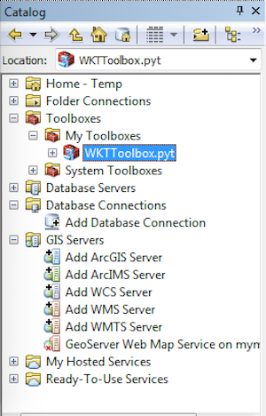
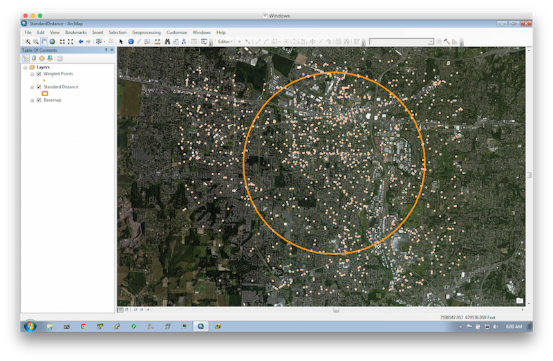

# Calculating weighted variance using Spark

The `stat()` function on a `DoubleRDD` calculates in a numerically robust way the count, mean and variance of the RDD values
and returns that information in a [StatCounter](https://spark.apache.org/docs/1.3.0/api/scala/index.html#org.apache.spark.util.StatCounter) instance.

The input values to the above function are all unweighted and I ran into a situation where each input value is associated with a weight
and I needed to calculate the weighted mean and weighted variance. And of course, all that has to be done online and on massive RDDs.

The [Algorithms for calculating variance](http://en.wikipedia.org/wiki/Algorithms_for_calculating_variance#On-line_algorithm) article gave me a good refresher on the weighted incremental process.
So, I blatantly ripped the original `StatCounter` code into `WeightedStatCounter` and adjusted the `merge` functions to account for weighted inputs in the form of `WeightedValue`.

The code is written in [Scala](http://www.scala-lang.org/), so I created implicit classes to enable the invocation of the `stats` function on an `RDD` of `WeightedValue` and on the "new" [DataFrame](https://databricks.com/blog/2015/02/17/introducing-dataframes-in-spark-for-large-scale-data-science.html)

```scala
val values = Seq(
  WeightedValue(10.0, 1.0),
  WeightedValue(12.0, 2.0),
  WeightedValue(14.0, 3.0),
  WeightedValue(16.0, 2.0)
)
val stats = sc.parallelize(values).stats()
```

Given for example points.csv

| ID | X | Y | W | 
|----|---|---|---|
|30|7600622.8|664895.8|1|
|31|7600882.6|664909.4|2|
|32|7600886.9|665019.2|2|


```scala
val rows = sc.textFile("points.csv")
  .flatMap(line => {
  try {
    val splits = line.split(',')
    val x = splits(1).toDouble
    val y = splits(2).toDouble
    val w = splits(3).toDouble
    Some(Row(x, y, w))
  }
  catch {
    case t: Throwable => None
  }
})

val schema = StructType(
  Seq(
    StructField("x", DoubleType),
    StructField("y", DoubleType),
    StructField("w", DoubleType)
  )
)

val df = sqlContext.createDataFrame(rows, schema)

val xStats = df.stats("x", "w")
```

## Use case - Standard Distance

[Standard Distance](http://resources.arcgis.com/en/help/main/10.2/index.html#/Standard_Distance/005p0000001m000000/) Measures the degree to which features are concentrated or dispersed around the geometric mean center.


And here is the math:


      
## Compile and Running

```shell
mvn package
```

```shell
java -jar target/spark-stat-1.0-SNAPSHOT.jar
```

This produces by default the file ```/tmp/wkt.txt```. It is a columnar text file whose fields are tab separated. The fields are:

| POLYGON WKT | X CENTER | Y CENTER | STANDARD DISTANCE |
|-------------|----------|----------|-------------------|

The content can be converted to a FeatureClass using an [ArcPy toolbox](http://resources.arcgis.com/en/help/main/10.2/index.html#//001500000022000000) `WKTToolbox.pyt`.



And here is the result:



